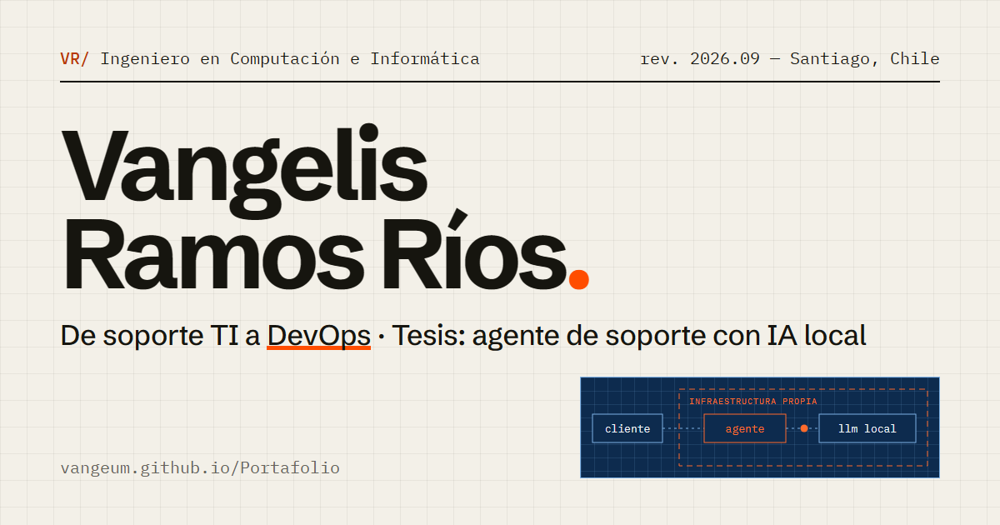

# Portafolio · Vangelis Ramos Ríos

Portafolio técnico de **Vangelis Ramos Ríos**, Ingeniero en Computación e Informática (Universidad Andrés Bello), de Santiago, Chile. Vengo del soporte TI y voy hacia DevOps. Mi tesis fue un agente de soporte con IA local para atención al cliente. Hoy trabajo como Analista de Servicios y Experiencia Digital en Grupo COMGRAP.

**Ver en vivo:** https://vangeum.github.io/Portafolio/
**CV en PDF:** [cv/Vangelis-Ramos-CV.pdf](cv/Vangelis-Ramos-CV.pdf)



## Qué incluye

- La tesis como proyecto principal, con un diagrama animado de su arquitectura
- Experiencia en soporte TI, desde la práctica profesional hasta el cargo actual
- La ruta hacia DevOps y las habilidades agrupadas por área
- 11 certificaciones con enlace de verificación (IBM, Autodesk, Coursera y UAB)
- Dos modos visuales: **papel** (manual técnico) y **plano** (blueprint), con la preferencia guardada en el navegador
- Versión imprimible que funciona como CV de 2 páginas

## Tecnología

Sitio estático sin frameworks ni paso de compilación:

- **HTML** semántico con metadatos para SEO, Open Graph y schema.org
- **CSS** propio con variables para los dos modos, diseño responsive desde 360 px y estilos de impresión
- **SVG** animado para el diagrama de la tesis, con versión horizontal y vertical
- **JavaScript** liviano sin dependencias: menú móvil, cambio de modo, revelado al hacer scroll y progreso de la ruta. Todas las animaciones respetan `prefers-reduced-motion`
- Publicado con **GitHub Pages**

```
index.html
assets/css/styles.css
assets/js/main.js
assets/img/          favicon e imagen para redes sociales
cv/                  CV en PDF generado desde la versión imprimible
```

## Ejecutar en local

```bash
python -m http.server 8080
```

Luego abre http://localhost:8080.

## Actualizar el CV en PDF

El PDF se genera desde la misma página con los estilos de impresión. Con el servidor local corriendo, en Windows:

```bash
"C:\Program Files (x86)\Microsoft\Edge\Application\msedge.exe" --headless=new --no-pdf-header-footer --print-to-pdf=cv\Vangelis-Ramos-CV.pdf http://localhost:8080/
```

También puedes abrir la página en el navegador, usar **Imprimir → Guardar como PDF** y reemplazar el archivo en `cv/`.

## Contacto

- Email: contactovange02@gmail.com
- LinkedIn: [linkedin.com/in/vangelis-ramos](https://www.linkedin.com/in/vangelis-ramos/)
